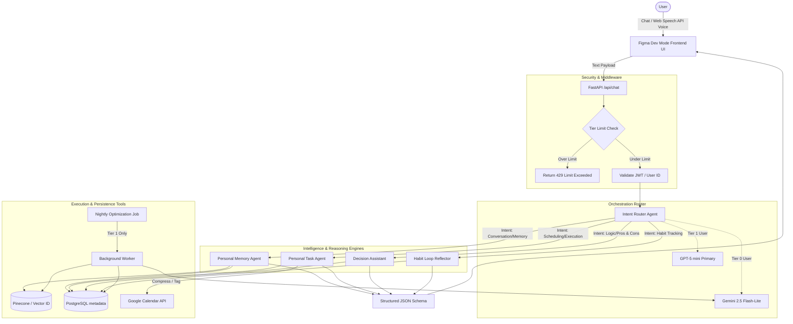

# Memora Phase 1: Data Flow & Architecture

This document outlines the directory structure for Phase 1 of the Memora project, including the Tier Architecture concepts. It provides a visual flowchart explaining how data moves from the user through the various tools, agents, and storage layers based on the predefined schemas.

## Project Directory Structure

```text
memora.ai/
├── src/
│   ├── api/                   # FastAPI routing endpoints
│   │   ├── chat.py            # Real-time chat & websocket limits
│   │   ├── memories.py        # Memory CRUD operations
│   │   ├── learning.py        # Vault uploads & retrieval
│   │   ├── habits.py          # Habit tracking endpoints
│   │   └── voice.py           # Voice transcript processing
│   ├── agents/                # LangGraph/LLM Agent Definitions
│   │   ├── router.py          # Intent classification & Tier routing
│   │   ├── memory_agent.py    # Fact extraction, scoring & recall
│   │   ├── task_agent.py      # Action parsing
│   │   ├── decision_assistant.py # Analytical matrices
│   │   └── habit_reflector.py # Periodic insight generation
│   ├── core/                  # App initialization, config
│   │   ├── config.py          # .env loading (Keys, DB URIs)
│   │   └── security.py        # Tier limit middleware, OAuth
│   ├── db/                    # Data Access Layers
│   │   ├── postgres.py        # Relational connections
│   │   ├── pinecone.py        # Vector connections
│   │   └── repository.py      # Base DB operations
│   ├── services/              # External integrators & logic
│   │   ├── llm.py             # GPT-5 mini / Gemini Flash-Lite logic
│   │   ├── scheduler.py       # Cron jobs
│   │   └── background_tasks.py# Async optimizations (Tier 1)
│   ├── models/                # Pydantic schema definitions
│   │   ├── user.py            # User & Tier profiling
│   │   ├── memory.py          # Memory schema
│   │   ├── learning_item.py   
│   │   ├── habit.py           
│   │   └── decision.py        
│   ├── tests/                 # Unit and E2E tests
│   └── main.py                # FastAPI app instantiation
├── docs/
│   ├── Phase1_ToDo.md         # Implementation checklist
│   ├── memoraarchitecture.md  # 5-Phase strategic architecture
│   ├── TierArchitecture.md    # Cost-control LLM usage specs
│   ├── data_flow.md           # This document
│   └── assets/                # Stored diagrams/images
├── requirements.txt           # Python dependencies
├── .env.example               # Environment variables template
├── .replit                    # Replit execution environment
└── replit.nix                 # Replit dependencies
```

---

## System Data Flow & Schema Architecture

The following diagram illustrates the flow of data from the User to the Memora backend, detailing how the `Security / Tier Middleware` intercepts traffic to apply caps, how the `Agent Router` selects the appropriate LLM, and how the specialized agents fulfill user requests leveraging both vector (`Pinecone`) and relational (`PostgreSQL`) databases.



### Flow Breakdown & Agent Schemas

1. **User Input & Tier Middleware**:
   The user sends a message or uses browser-native voice via the Figma Dev Mode generated UI. The payload arrives at FastAPI. Before any LLM processing happens, `core/security.py` checks the user's `subscription_tier` against their `daily_usage_logs` stored in PostgreSQL. If caps are exceeded, a 429 response is triggered immediately.

2. **Intent Routing**:
   The input reaches `agents/router.py`. Here, a lightweight intent classification prompt decides which specialized sub-agent the user needs. 
   - **Tier 0 Constraint**: The router forces all output generation through `Gemini 2.5 Flash-Lite`.
   - **Tier 1 Routing**: The router uses `GPT-5 mini` for the interaction.

3. **Specialized Agent Execution (Tools & DBs)**:
   - **Memory Agent**: Receives text, queries `Pinecone` for semantic similarity (fetching fewer chunks for Tier 0 vs Tier 1), extracts new facts, and stores them in `PostgreSQL`. It returns a schema outputting `{ "response": "string", "extracted_memories": ["string"] }`.
   - **Task Agent**: Parses actions into structured sub-tasks. Schema: `{ "response": "string", "tasks": [{"title": "string", "due_date": "datetime"}] }`. It may use external tools like Google Calendar API.

4. **Background Async Flow**:
   Tier 1 users benefit from `services/background_tasks.py`. Nightly, a cron job fetches un-optimized active memories from PostgreSQL, sends them to `Gemini 2.5 Flash-Lite` to create grouped summaries, and updates Pinecone vectors.
